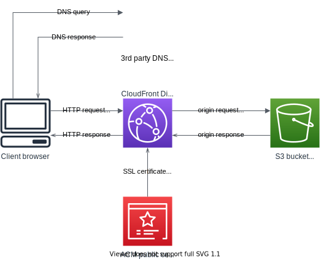

# Cloud Resume Challenge - Static web frontend

This project is part of my attempt on [Cloud Resume Challenge](https://cloudresumechallenge.dev/)
- Static web frontend - this project
- [Serverless backend](https://github.com/luzhkovvv/cloudresumecounter)
- [CI/CD pipelines](https://github.com/luzhkovvv/cloudresumepipelines)

This project provides frontend part of cloud resume web site. Static web site files, including HTML, CSS and JS code are stored here.

## Architecture

This project uses following AWS services:
- S3 - to store static web content;
- CloudFront - to serve web site to end users, utilizing caching and encryption;
- ACM - to issue, store and provide CloudFront with SSL certificate.

3rd party DNS hosting is used to host website CNAME record.

Logical diagram of solution:

### CloudFront distribution

CloudFront distribution configured with custom hostname CNAME, certificate from ACM and S3 bucket origin, OAI is used to access S3 bucket.

### ACM public certificate

Public certificate is requested from and issued by AWS for custom hostname using DNS verification, DNS verification is completed by adding CNAME record to 3rd party DNS provider hosted zone.

### S3 bucket

Content is stored in S3 bucket with public access disabled using S3 Standard storage class. S3 bucket policy allows access using CloudFront distribution OAI.